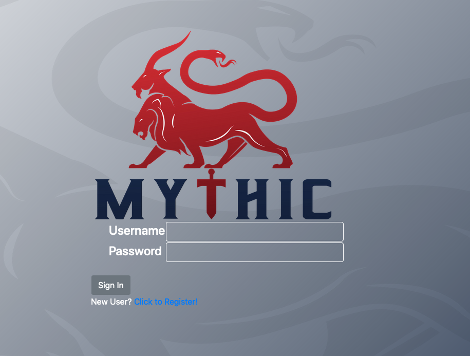

# Wild Hunt

Wild Hunt is a project aimed at identifying attackers using offensive techniques commonly employed in the reconnaissance phase of a penetration test.

The tools that will be used are:

- [Nuclei](https://github.com/projectdiscovery/nuclei)
- Masscan
- [TLS-Scan](https://github.com/prbinu/tls-scan)
- Shodan

The techniques will be presented in a cookbook fashion, so it will be up to the reader to extract the meaningful information to incorporate into their methodology.

## SSL Certificates 

Less sophisticated attackers might use the default certificates for their C2 infrastructure. Whilst this might sound like an eresy to a professional red teamer, this might happen.

### Cobaltstrike 

With this recipe, we will scan for cobaltstrike management interface exposed over port 50050. To identify instances of these, we will scrape the TLS certificate and look for the "cobaltstrike" keyword:

```
masscan -p 50050 IP -oG cobaltstrike

cat cobaltstrike | awk '{print $2}' > cobaltstrike-alive
./tls-scan --infile=cobaltstrike-alive --port=50050 --starttls=tls -b 100 -o cs.js

grep cobaltstrike cs.js
```

The HTTPS listener also have a default certificate hash, which might be useful as well.

## Active Discovery 

For both management interfaces and default communication profiles, a number of nuclei templates were created. It would be possible to scan a list of URLs and match them against a list of known C2 cremeworks.

The example below shows a live Mythic management console:  

```
echo https://142.93.194.142:7443 | ./nuclei -t ~/Desktop/repositories/wild-hunt/nuclei-templates

                       __     _
     ____  __  _______/ /__  (_)
    / __ \/ / / / ___/ / _ \/ /
   / / / / /_/ / /__/ /  __/ /
  /_/ /_/\__,_/\___/_/\___/_/   v2.1

		projectdiscovery.io

[WRN] Use with caution. You are responsible for your actions
[mythic-management-interface] [http] https://142.93.194.142:7443/login
```



Currently, the following templates are present:

- Cobalt Strike default 404 response
- Covenant default profile
- Meterpreter protocol
- Mythic and Covenant management interfaces